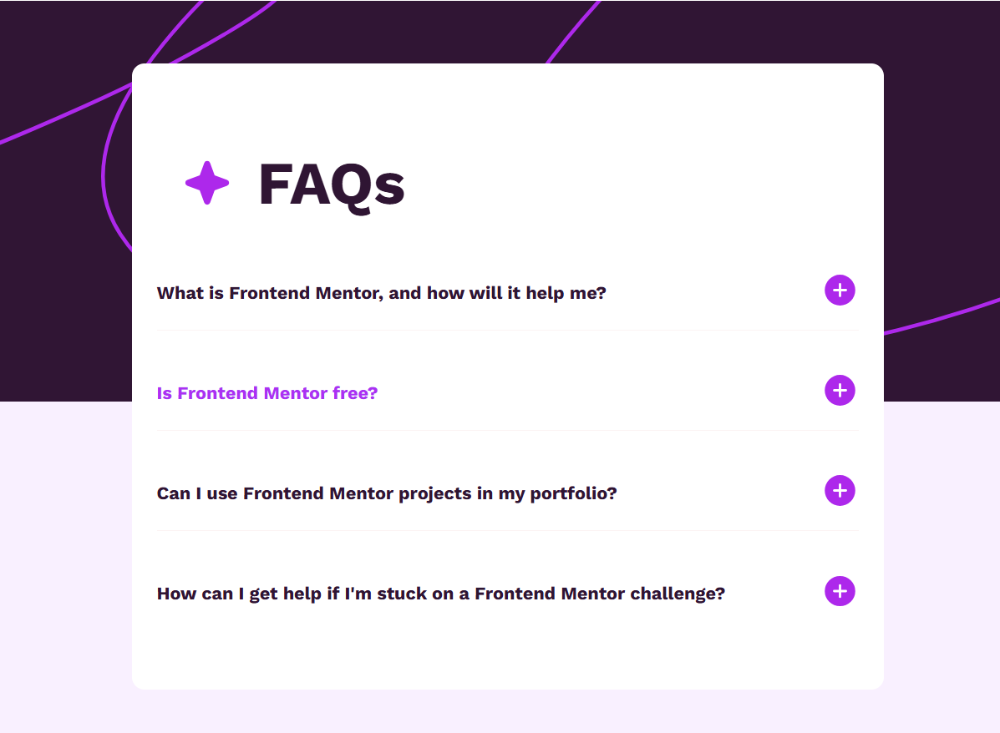

## FAQ Accordion

An interactive FAQ accordion built with HTML, CSS, and JavaScript.

- Expanding/collapsing answers
- Smooth transitions
- Responsive design

**Live Demo:** [View on Netlify](https://faq-accordion.netlify.app)  
**Source Code:** [GitHub](https://github.com/yourusername/faq-accordion)

### Screenshot

## 🛠️ Technologies Used

- **HTML5** for structure
- **CSS3** for styling & transitions
- **JavaScript (ES6)** for interactivity

## 📬 Contact

👩‍💻 Created by **Prakruti Pareek**

- GitHub: [PrakrutiPareek](https://github.com/PrakrutiPareek)
- Portfolio: [prakruti-pareek-portfolio.netlify.app](https://prakruti-pareek-portfolio.netlify.app/)
